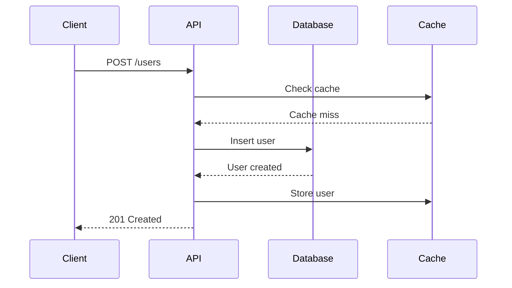
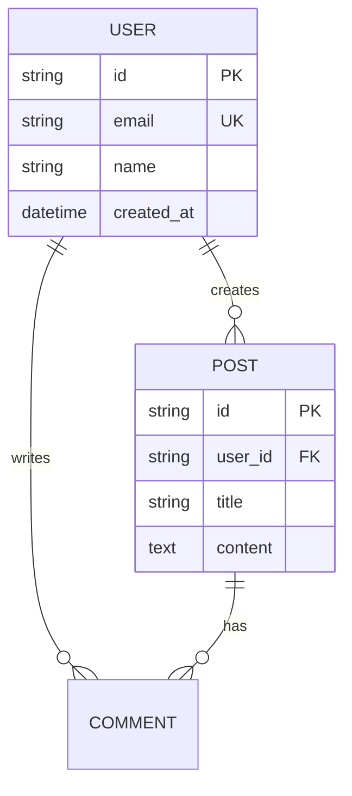

# User Guides & Tutorials

> Reference for: Code Documenter
> Load when: Creating getting started guides, tutorials, troubleshooting docs, end-user documentation

## Tutorial Structure

### Progressive Learning Path

```markdown
# Getting Started with API

## Prerequisites
Before you begin, ensure you have:
- [ ] Node.js 18+ installed
- [ ] An API key from your dashboard
- [ ] Basic knowledge of REST APIs

## Quick Start (5 minutes)

### 1. Install the SDK
```bash
npm install @myapi/sdk
```

### 2. Create Your First Request
```typescript
import { Client } from '@myapi/sdk';

const client = new Client({ apiKey: 'your_key' });
const users = await client.users.list();
console.log(users);
```

### 3. Verify It Works
Run the code and you should see a list of users.

**Expected output:**
```json
{
  "data": [
    { "id": "1", "name": "Alice" },
    { "id": "2", "name": "Bob" }
  ],
  "total": 2
}
```

## Next Steps
- [Authentication Guide](/docs/auth) - Learn about OAuth and API keys
- [Advanced Queries](/docs/queries) - Filtering, sorting, pagination
- [Error Handling](/docs/errors) - Handle errors gracefully
```

### Step-by-Step Tutorial

```markdown
# Tutorial: Building a User Dashboard

**What you'll learn:**
- Fetching user data from the API
- Handling pagination
- Displaying data in a table
- Adding real-time updates

**Time:** 30 minutes
**Level:** Intermediate

## Step 1: Set Up the Project

Create a new project:
```bash
mkdir user-dashboard
cd user-dashboard
npm init -y
npm install @myapi/sdk react
```

## Step 2: Fetch Users

Create `src/api/users.ts`:
```typescript
import { Client } from '@myapi/sdk';

const client = new Client({ apiKey: process.env.API_KEY });

export async function getUsers(page = 1, limit = 20) {
  const response = await client.users.list({ page, limit });
  return response;
}
```

**What's happening:**
1. We import the SDK client
2. Initialize it with our API key from environment
3. Create a helper function that fetches paginated users

## Step 3: Create the Component

Create `src/components/UserTable.tsx`:
```typescript
import { useState, useEffect } from 'react';
import { getUsers } from '../api/users';

export function UserTable() {
  const [users, setUsers] = useState([]);
  const [loading, setLoading] = useState(true);

  useEffect(() => {
    async function fetchData() {
      const data = await getUsers();
      setUsers(data.data);
      setLoading(false);
    }
    fetchData();
  }, []);

  if (loading) return <div>Loading...</div>;

  return (
    <table>
      <thead>
        <tr>
          <th>Name</th>
          <th>Email</th>
        </tr>
      </thead>
      <tbody>
        {users.map(user => (
          <tr key={user.id}>
            <td>{user.name}</td>
            <td>{user.email}</td>
          </tr>
        ))}
      </tbody>
    </table>
  );
}
```

## Step 4: Test It

Run your app:
```bash
npm run dev
```

You should see a table with user data.

## Checkpoint
At this point, you have:
- [x] Set up the SDK
- [x] Created an API helper
- [x] Built a user table component
- [ ] Added pagination
- [ ] Added real-time updates

## Next: Adding Pagination

[Continue to Step 5 →](/docs/tutorial/step-5)
```

## Information Architecture

### Content Hierarchy

```markdown
Documentation/
├── Getting Started/
│   ├── Quick Start (5 min)
│   ├── Installation
│   ├── Authentication
│   └── First Request
│
├── Guides/
│   ├── User Management
│   ├── File Uploads
│   ├── Webhooks
│   └── Rate Limiting
│
├── API Reference/
│   ├── Users API
│   ├── Files API
│   └── Webhooks API
│
├── SDK Documentation/
│   ├── Python SDK
│   ├── TypeScript SDK
│   └── Go SDK
│
├── Tutorials/
│   ├── Build a Dashboard (30 min)
│   ├── Integrate Authentication (45 min)
│   └── Real-time Sync (60 min)
│
└── Resources/
    ├── Troubleshooting
    ├── FAQ
    ├── Best Practices
    └── Migration Guides
```

## Writing Techniques

### Task-Based Writing

```markdown
# How to Upload a File

**Goal:** Upload an image file to your account storage

**Time:** 5 minutes

## Steps

### 1. Prepare the file
Get the file from user input or file system:
```typescript
const file = document.querySelector('input[type="file"]').files[0];
```

### 2. Create form data
```typescript
const formData = new FormData();
formData.append('file', file);
formData.append('folder', 'avatars');
```

### 3. Upload with the SDK
```typescript
const result = await client.files.upload(formData);
console.log('File URL:', result.url);
```

## Common Issues

**"File too large" error:**
Maximum file size is 10MB. Compress images before uploading.

**"Invalid file type" error:**
Only .jpg, .png, .gif are allowed. Check the file extension.

## Related
- [File API Reference](/api/files)
- [Handling Upload Progress](/guides/upload-progress)
```

### Progressive Disclosure

```markdown
# Authentication

## Basic: API Keys (Recommended for Getting Started)

API keys are the simplest way to authenticate.

```typescript
const client = new Client({ apiKey: 'your_key' });
```

**When to use:** Scripts, internal tools, testing

[Generate an API key →](/dashboard/api-keys)

<details>
<summary>Advanced: OAuth 2.0</summary>

For user-facing applications, use OAuth 2.0.

### Authorization Code Flow

1. Redirect user to authorization URL:
```typescript
const authUrl = client.oauth.getAuthUrl({
  redirectUri: 'https://yourapp.com/callback',
  scopes: ['read:users', 'write:users'],
});
window.location.href = authUrl;
```

2. Handle the callback:
```typescript
const code = new URLSearchParams(window.location.search).get('code');
const tokens = await client.oauth.exchangeCode(code);
```

3. Use the access token:
```typescript
const client = new Client({ accessToken: tokens.access_token });
```

[Full OAuth guide →](/guides/oauth)
</details>

<details>
<summary>Enterprise: JWT Tokens</summary>

For service-to-service authentication, use JWTs.

```typescript
const jwt = createJWT({
  issuer: 'your-service',
  subject: 'service-account-id',
  privateKey: process.env.PRIVATE_KEY,
});

const client = new Client({ jwt });
```

[JWT setup guide →](/guides/jwt)
</details>
```

## Visual Communication

### Diagram Integration

```markdown
# System Architecture

## Request Flow



## Data Model


```

### Screenshot Annotations

```markdown
# Dashboard Overview


**Key features:**

1. **Navigation** - Switch between sections
2. **API Key** - Copy your key (click to reveal)
3. **Usage Stats** - Current month's API calls
4. **Quick Actions** - Generate new key, view docs
5. **Recent Activity** - Last 10 API requests

## Creating Your First API Key

1. Click "Generate New Key" (highlighted in green)
2. Enter a description like "Production API"
3. Select permissions (default: all)
4. Click "Create"
5. **Important:** Copy the key immediately - it won't be shown again


```

## Troubleshooting Guides

### Problem-Solution Format

```markdown
# Troubleshooting

## Authentication Errors

### "Invalid API key"

**Symptoms:**
- 401 Unauthorized error
- Error message: "Invalid API key"

**Causes:**
1. API key was copied incorrectly (extra spaces)
2. API key was revoked
3. Using test key in production environment

**Solutions:**

**1. Verify the key:**
```bash
# Check for extra spaces
echo -n "$API_KEY" | wc -c  # Should be exactly 32 characters
```

**2. Regenerate the key:**
- Go to [dashboard](/dashboard)
- Click "Revoke & Regenerate"
- Update your environment variables

**3. Check environment:**
```typescript
console.log('Environment:', process.env.NODE_ENV);
console.log('API URL:', client.baseUrl);
```

**Still not working?**
[Contact support](/support) with your request ID from the error response.

---

### "Rate limit exceeded"

**Symptoms:**
- 429 Too Many Requests error
- Requests failing intermittently

**Immediate fix:**
Wait 60 seconds and retry.

**Long-term solutions:**

**1. Implement exponential backoff:**
```typescript
async function retryWithBackoff(fn, maxRetries = 3) {
  for (let i = 0; i < maxRetries; i++) {
    try {
      return await fn();
    } catch (error) {
      if (error.status === 429 && i < maxRetries - 1) {
        await sleep(Math.pow(2, i) * 1000);
        continue;
      }
      throw error;
    }
  }
}
```

**2. Batch requests:**
Instead of 100 individual requests, use batch endpoints.

**3. Upgrade your plan:**
[View plans](/pricing) - Higher tiers have increased limits.
```

## FAQ Section

```markdown
# Frequently Asked Questions

## General

### What's included in the free tier?
- 1,000 API requests/month
- 1GB storage
- Community support
- All core features

### How do I upgrade?
Click "Upgrade" in your [dashboard](/dashboard) and select a plan.

## Technical

### Can I use this in production?
Yes, the API is production-ready with 99.9% SLA on paid plans.

### What's the rate limit?
- Free: 10 requests/minute
- Pro: 100 requests/minute
- Enterprise: Custom limits

### Do you support webhooks?
Yes! See [Webhooks Guide](/guides/webhooks) for setup.

### Which regions are available?
Currently: US East, US West, EU Central, Asia Pacific.

## Billing

### How does billing work?
- Monthly subscription
- Pay-as-you-go for overages
- Cancel anytime

### What payment methods do you accept?
Credit card, PayPal, wire transfer (annual plans only).

---

**Can't find your answer?**
- [Browse all docs](/docs)
- [Ask the community](https://community.example.com)
- [Contact support](/support)
```

## Quick Reference

| Content Type | Best For | Key Elements |
|-------------|----------|-------------|
| Quick Start | New users (5 min) | Prerequisites, minimal code, verify |
| Tutorial | Learning by doing | Steps, checkpoints, working code |
| How-To Guide | Specific tasks | Goal, steps, troubleshooting |
| Reference | Looking up details | Comprehensive, searchable |
| Explanation | Understanding concepts | Why, not how |

| Writing Principle | Technique |
|------------------|-----------|
| Clarity | Active voice, short sentences |
| Scannability | Headings, lists, code blocks |
| Completeness | Prerequisites, next steps, related links |
| Accuracy | Test all code, version specifics |
